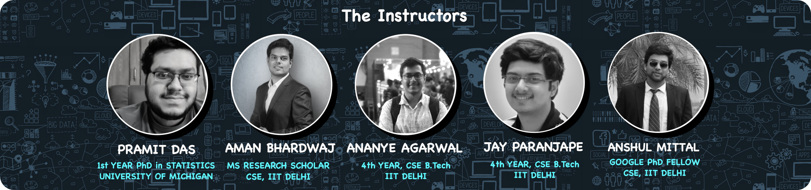

<h1 align = "center"> Summer-of-ML-2021</h1>

The workshop is a month-long event with 5 major workshops across 3 weeks and a hackathon. Detailed schedule and other information of the series can be found on our [website](https://ramneet-singh.github.io/SummerOfML-2021/agenda).

   
  The amazing lineup of instructors for the workshops

We will start with the basic mathematics used in ML and intorduce some ML methods like Naive Bayes and Logistic Regression, that are built primarily on these mathematics. We will gradually move on to Deep Learning in the second week, with simple applications and a hands-on introduction to PyTorch. Finally, we will  explore some important methods in Deep Learning like CNNs and RNNs. To test your understanding of the concepts you learned in the workshops, we will have a final 1-week hackathon.
